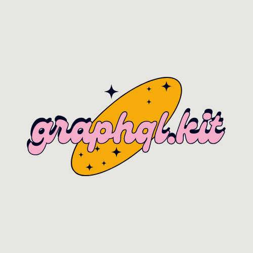

<p align="center">
  
</p>
<p align="center">
    GraphQL for Clojure Ring Implementations
</p>

## Motivation

For those who don't want to use pedestal, or merely prefer other web servers,
this one's for you :cheers:.

This README is still a todo, there is a bit to document.
But between what is here and the [examples](./examples), is enough to work off of for the curious.


## Quick Start

### Install
Once there is more rigor (i.e. test suite) applied to the code in this repo,
a clojars release will be supported. Until then, if you're a trail blazer:
```clojure
land.bnert/graphql.kit {:git/url "https://github.com/bnert-land/graphql.kit"
                        :git/sha "..."}
```

Additionally, `graphql.kit` requires peer dependencies. They are as follows:
- (Optional) [Aero](https://github.com/juxt/aero), if you want to use the `graphql.kit.loaders.aero` edn loader.
- [Lacinia](https://github.com/walmartlabs/lacinia) for the `graphql.kit.engines.lacinia` namespace.

**Note**: if all this talk about "loaders" and "engines" has you confused, see the [Concepts section](#concepts).

Example project `deps.edn` using [`aleph`](https://github.com/clj-commons/aleph):
```clojure
{:paths ["src" "resources"]
 :deps
 {aleph/aleph {:mvn/version "0.6.4"}
  com.walmartlabs/lacinia {:mvn/version "1.2.1"}
  land.bnert/graphql.kit {:git/url "...", :git/sha "..."}
  ring/ring-core {:mvn/version "1.11.0"}
  ring/ring-json {:mvn/version "0.5.1"}
  ; Optional, uncomment if you want to use aero
  #_#_aero/aero {:mvn/version "1.1.6"}}}

```

### Write Your App
The below app example is assuming you're definig your schema as edn as a resource:
```clojure
(ns app.core
  (:require
    [aleph.http :as http]
    [graphql.kit.engines.lacinia :as kit.engine]
    [graphql.kit.loaders.edn :as kit.loader]
    [graphql.kit.servers.aleph.ws :as kit.ws]
    [graphql.kit.servers.ring.http :as kit.http]
    [graphql.kit.servers.ring.graphiql :as kit.graphiql]
    [ring.middleware.keyword-params :as mw.keyword-params]
    [ring.middleware.params :as mw.params]
    [ring.middleware.json :as mw.json]))

(def port 9109)

(def kit-config
  {:graphql.kit/engine (kit.engine/engine!)
   :graphql.kit/loader (kit.loader/loader!)

   ; Everything config option w/o a :graphql.kit namespace is passed to
   ; the underlying graphql engine
   ;

   ; The `:options` are passed as options to Lacinia.
   ; You could use a manifold executor instead of the default
   ; thread pool.
   :options  {#_#_:executor (manifold.executor/execute-pool)}

   ; Schema can be
   ;   1. A map w/ `:resource` key. The path of the `:resource` key will be loaded using `:graphql.kit/loader`.
   ;   2. A map w/ `:path` key. The path will load a file using `:graphql.kit/loader`
   ;   3. A map w/o a `:path` or `:resource` key will be treated as a schema
   ;   4. A string, which signals that the schema is in SDL format.
   :schema   {:resource "graphql/schema.edn"}

   ; Resolvers have some extra structure, will go into more detail about the specifics of the lacinia
   ; engine at a later point in the docs.
   :resolvers
   {:query        {:Query/thing resolve-thing}
    :subscription {:Subscription/events subscribe-to-events}}

(def http-handler
  (kit.http/handler kit-config))

(def ws-handler
  (kit.ws/handler kit-config))

(def graphiql-handler
  (kit.graphiql/handler
    {:enabled? true ; defaults to false
     :url             "http://localhost:9109/graphql"
     :subscriptionUrl "ws://localhost:9109/graphql/subscribe"}))

(defn app [{:keys [request-method uri] :as req}]
  (case [request-method uri]
    [:get "/graphql"]
      (http-handler req)
    [:post "/graphql"]
      (http-handler req)
    [:get "/graphql/subscribe"]
      (ws-handler req)
    [:get "/graphiql"]
      (graphiql-handler req)
    #_default
      {:status 404}))

(defn -main [& args]
  (println (format "Starting server @ http://localhost:%s" port))
  (http/start-server
    (-> app
        (mw.json/wrap-json-response)
        (mw.keyword-params/wrap-keyword-params)
        (mw.params/wrap-params)
        (mw.json/wrap-json-params))
    {:port port}))
```

## Examples

- [Aleph w/ Lacinia Engine, GraphiQL](./examples/aleph/)
- [Ring Jetty w/ Lacinia Engine, GraphiQL](./examples/ring-jetty)
- **TODO** Fullstack using the two above w/ Apollo Client
- **TODO** TodoMVC
- **TODO** Chat app


## Concepts
### Engines

In the context of `graphql.kit`, an "engine" is responsible for compiling a GraphQL schema
and executing queries, subscription and dispatching resolver functions.

Current engine implementations:
| Name                                              | Compliant w/ GraphQL Spec | Compliant w/ Apollo Federation |
|:--------------------------------------------------|:--------------------------|:-------------------------------|
| [Lacinia](https://github.com/walmartlabs/lacinia) | yes                       | yes, only w/ SDL               |


In order to provide a well featured library, and given this library is in early stages,
the focus is on integrating [Lacinia](https://github.com/walmartlabs/lacinia).

Other Clojure or Java based GraphQL engines may be integrated, however, that is
not the focus at this time. There is an [engine protocol](https://github.com/bnert-land/graphql.kit/blob/main/src/graphql/kit/protos/engine.clj), which when satistfied can plug into `graphql.kit`.


### Loaders

A "loader" is responsible for loading a GraphQL schema. The current loaders are:

- [Default](https://github.com/bnert-land/graphql.kit/blob/main/src/graphql/kit/loaders/default.clj), which simply reads a file from either a file path or resource.
- [EDN](https://github.com/bnert-land/graphql.kit/blob/main/src/graphql/kit/loaders/edn.clj), which reads file content from either the path or resource and parses the file into Clojure data structure.
- [Aero](https://github.com/bnert-land/graphql.kit/blob/main/src/graphql/kit/loaders/aero.clj) does everything that the EDN loader does, but also provides all the functionality exposed by Aero when reading configuration.
  - The Aero loader requires a peer dependency of [`juxt/aero`](https://github.com/juxt/aero)

If none of the above are satisfactory, there is a [loader protocol](https://github.com/bnert-land/graphql.kit/blob/main/src/graphql/kit/protos/loader.clj) which can be implemented and plugged into `graphql.kit`.


### Handlers

A "handler" is higher order function which takes a configuration map and produces a
ring compliant handler.

Current handler implementaions:
- GraphQL over HTTP
  - Ring Compliant Servers
- [GraphQL over WebSocket](#one)
  - Aleph
  - Ring Compliant Servers, as of [1.11.0 spec](#two)
- [Graphql over SSE](#three)
  - None right now


## References

- <a id="one">[1]:</a> [GraphQL over WebSocket Spec](https://github.com/enisdenjo/graphql-ws/blob/master/PROTOCOL.md)
- <a id="two">[2]:</a> [Ring 1.11.0 WebSocket Spec](https://github.com/ring-clojure/ring/blob/master/SPEC.md#3-websockets)
- <a id="three">[3]:</a> [GraphQL over Server-Sent Events Spec](https://github.com/enisdenjo/graphql-sse/blob/master/PROTOCOL.md)


---

Copyright (c) Brent Soles. All rights reserved.

See [LICENSE](./LICENSE) for license information.
